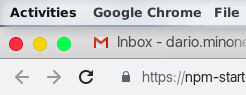
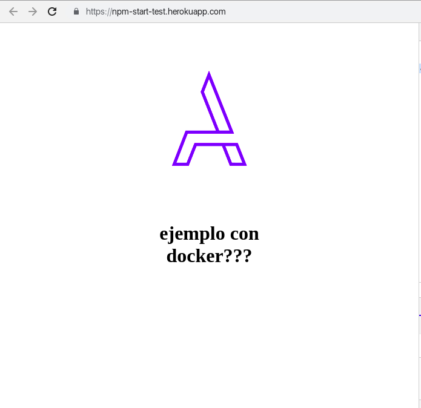

# Heroku Deploy Test Project

Este proyecto permite deployar a heroku una app nodejs en dos formas distintas. Como app node y dentro de un container docker.
La intencion es que lo puedan usar para hacer deploys a heroku y para tener como referencia.

## Como usar este repo

Para usar este repositorio la forma mas simple y recomendada es hacer un fork y deployar el fork a heroku. De esta forma pueden hacer cambios y probar cosas nuevas.

### Hacer un fork
Apretando arriba a la derecha el boton fork en github

### Deployar a heroku
}

* Crear una cuenta en [heroku](https://www.heroku.com/) 
* Crear una app nueva en heroku
* En la pestaña deploy asociar el repo recien forkeado, marcar como deploy automatico

Con estos pasos cada cambio que hagan deberia disparar un nuevo deploy en heroku y en la url de la app (boton open app) deberian poder vere la applicacion.

## Sobre las configuraciones

### Como App Node

La configuración necesaria para que funcione en heroku es la siguiente.

* `package.json` con un script que corra la app: `npm start`
* `Procfile` con un script de que correr en heroku. 

### Como Docker Container 

La configuración necesaria para que funcione como docker container es la siguiente

* `package.json` con un script que corra la app: `npm start`
* `Dockerfile` con la configuración funcionando localmente
* `heroku.yml` con la config de como hacer el build y que correr. 

**Nota sobre el Dockerfile y heroku** 

El Dockerfile tiene comandos para cuando se hace el build y comandos para cuando se hace el run. CMD es para cuando se hace el run.
La config del run de heroku.yml es lo que tiene que hacer el container cuando arranca y remplaza el `CMD ["node", "/src/index.js"]`

